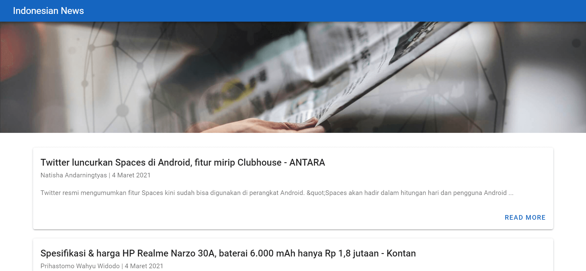
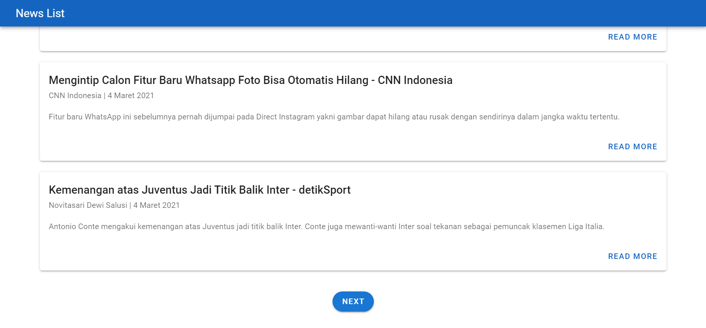
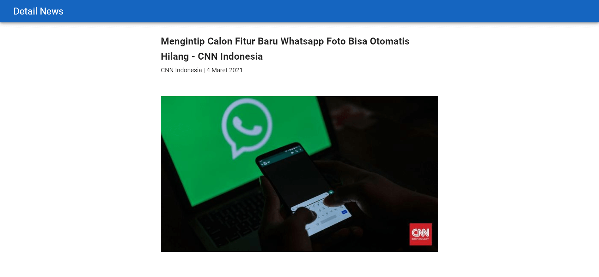

# simple-blog

Application to display news list, the data used is sourced from [NEWS API](https://newsapi.org/s/indonesia-news-api). This project was developed using Vue Js. You can see the demo app at [Simple News](https://simple-news-id.netlify.app/)


## Preview







## Build Setup

``` bash
# install Node Module dependencies
npm install

# serve with hot reload at localhost:8080
npm run serve

# build for production with minification
npm run build
```


## Technologies
This project uses several technologies listed below :

- **[Vuetify](https://vuetifyjs.com/en/)** is a Material Design component framework for Vue.js
- **[Axios](https://github.com/axios/axios)** is dependencies for Apis Consuming
- **[Vue Router](https://router.vuejs.org/)** is the official router for Vue.js
